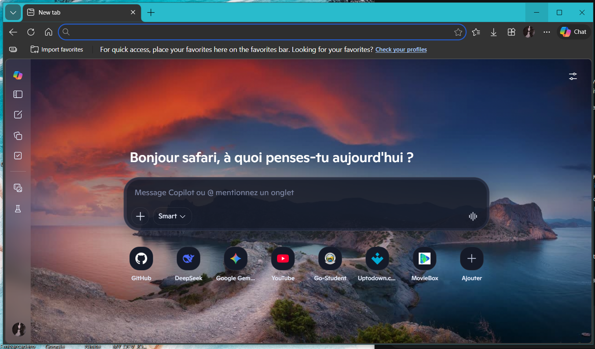
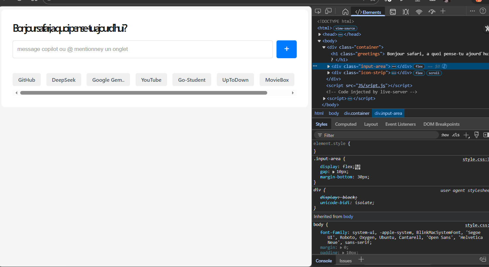
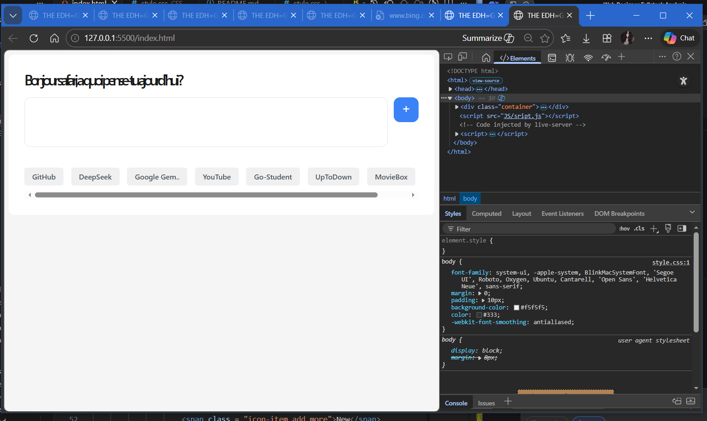

##### THE EDGE DESIGN LAYOUT

#### THIS IS THE IMAGE THAT WE WILL TARGET

## TASK 1: THE INPUT OG ENGE

## TASK 2:

    * TASK 2.1: THE TYPOGRATHY --> the greeting is in french and not in english

    * TASK 2.2: STYLE THE INPUT FIRST

## TASK 2.3:

    * STEP 1: FINE TUNNE THE + SYMBOLE
    * STEP 2: ADD MICRO-INTERACTIONS
    * STEP 3: MATCH THE EXACT BLUE
    * STEP 4: PERFECT ALIGNMENT
    * STEP 5: ADD A LOADING STATE
    * STEP 6: A PERFECT SQUARE

## TASK 3:

     * COMPLETING THE BODY

    